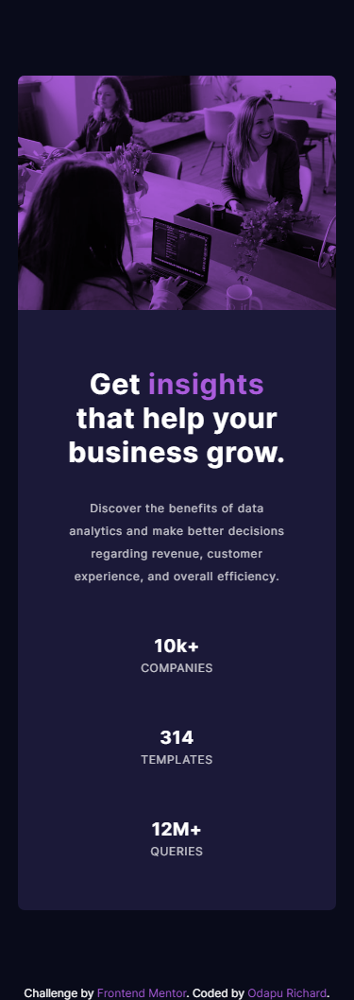

# Frontend Mentor - Stats preview card component solution

This is a solution to the [Stats preview card component challenge on Frontend Mentor](https://www.frontendmentor.io/challenges/stats-preview-card-component-8JqbgoU62). Frontend Mentor challenges help you improve your coding skills by building realistic projects. 

## Table of contents

- [Overview](#overview)
  - [The challenge](#the-challenge)
  - [Screenshot](#screenshot)
  - [Links](#links)
- [My process](#my-process)
  - [Built with](#built-with)
  - [What I learned](#what-i-learned)
- [Author](#author)

## Overview

### The challenge

Users should be able to:

- View the optimal layout depending on their device's screen size
- See hover states for interactive elements

### Screenshot




### Links

- Solution URL: [Solution](https://github.com/11-Ace/stats-preview-card-component-main)
- Live Site URL: [Link](https://11-ace.github.io/stats-preview-card-component-main/)

## My process

### Built with

- Semantic HTML5 markup
- CSS custom properties
- Flexbox

### What I learned

Learnt about 'mix-blend-mode' property and it's application

```css
picture img {
  mix-blend-mode: multiply;
}
```

## Author

- Frontend Mentor - [@yourusername](https://www.frontendmentor.io/profile/11=Ace)
- Twitter - [@11-Ace](https://www.twitter.com/@11ace__)